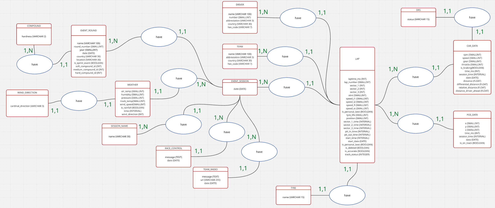
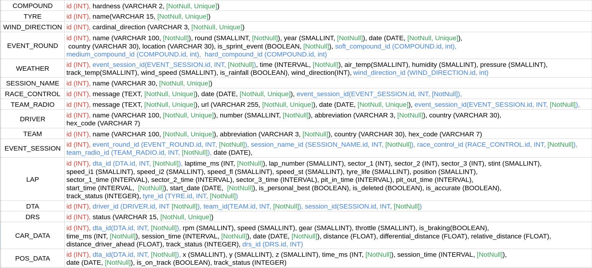
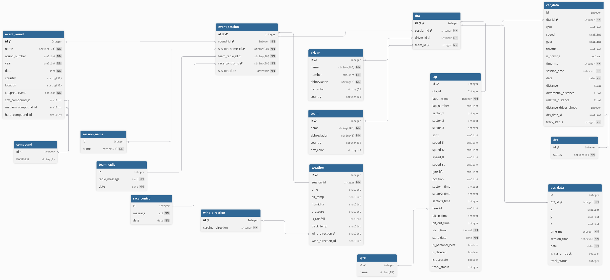

# 💾 F1 Analysis Ingestion — PostgreSQL Data Pipeline

This repository hosts the data ingestion scripts responsible for populating the PostgreSQL database used by the entire F1 Analysis project suite (Visualization, Dashboard, and Website backend).

Built purely in Python, the ingestion pipeline utilizes the fastf1 library to retrieve comprehensive Formula 1 session data and implements efficient, structured data injection into the relational database.

## 🚨 PROJECT STATUS: CORE INGESTION PROTOTYPE — ACTIVE DEVELOPMENT

The foundational scripts for adding Season/Round Metadata and Session Data have been implemented and validated. This module is the upstream provider for all other F1 Analysis project components.

## ⚙️ Core Ingestion Modules

The repository contains two main services that handle the sequential process of data population:
Service	Script	Description
Season & Round Service	season_service.py	This service is the first step. It fetches the complete calendar for a given F1 season and injects all Event Rounds (Grand Prix names, dates, numbers) into the PostgreSQL database.
Session Data Filler	session_data_filler.py	This service is the second step. It is designed to be run after the season structure is in place. It selects a specific Round/Session and injects the detailed F1 data (Lap, Timing, Car, Driver, Weather data) into their respective tables.

## 🚀 Getting Started

Prerequisites

You'll need Python ≥ 3.9 and the following components:

    Database: A running instance of PostgreSQL.

    Python Packages:

        fastf1 (for data retrieval)

        psycopg2-binary or similar (for PostgreSQL connection)

        pandas

        dotenv (for managing connection credentials)

Database Configuration

The ingestion scripts require access to your PostgreSQL instance. You should configure your database connection details (host, user, password, database name) in a file like .env in the project root.

⚙️ Workflow Overview

Data ingestion is a two-step process to maintain data integrity and a clear hierarchy:

    Run season_service.py:

        Prompts for the F1 Season Year.

        Fetches the official F1 calendar for that year.

        Inserts all race events and their round numbers into the EventRound table.

    Run session_data_filler.py:

        Prompts for the Season Year, Round Number, and Session Type (e.g., FP1, Q, R).

        Retrieves all raw session data (telemetry, laps, weather, etc.) via fastf1.

        Transforms and inserts the detailed data into all other dependent database tables (e.g., Lap, CarData, Driver, Weather, etc.).

<<<<<<< HEAD
##    Data Structure 
#### Methode Merise
##### MCD

##### MLD

##### MPD


=======
>>>>>>> 878bd40 (added new version of data insertion with sql alchemy)
## 📂 Folder Structure

The repository maintains a simple structure, keeping all primary execution logic within the src folder.
Plaintext

```text
f1_analysis_injestion/
│
├── backend/
│   ├── database
│   │   ├── __init__.py
│   │   ├── base.py
│   │   ├── models.py
│   │   └── f1_analysis.db
│   └── main.py
│
├── DEV/
│   └── dev.ipynb
│
├── src/
│   ├── season_service.py            # Injects Season/Round metadata
│   └── session_data_filler.py       # Injects detailed Session data
│
├── .env                            # Environment variables for DB connection
├── LICENSE
├── README.md
└── requirements.txt
```

## 📈 Example Usage

Step 1: Ingest Season Metadata

    python src/season_service.py

Prompted workflow:
    
    Year to Ingest ? 2025
    [LOG] Fetching 2025 F1 Calendar...
    [LOG] Inserting 24 Event Rounds into DB...
    [LOG] Ingestion complete for 2025 Season structure.

Step 2: Ingest Detailed Session Data
  
    python src/session_data_filler.py

Prompted workflow:

    Year ? 2025
    Round Number ? (1-24) 6
    Session ? (FP1, Q, R, S) R
    [LOG] Retrieving 2025 Round 6 (Monaco GP) Race Data...
    [LOG] Processing Lap, Timing, and Telemetry data...
    [LOG] Injected 1200 Lap records, 30 Driver records, and 15000 Telemetry records.
    [LOG] Data filler complete for 2025 Monaco GP Race.

## 👨‍💻 Author

Cyril Leconte 📍 Créteil, France

📧 cyril.leconte@proton.me

🔗 [LinkedIn](https://www.linkedin.com/in/cyril-leconte/) | [Kaggle](https://www.kaggle.com/cyrilleconte)
